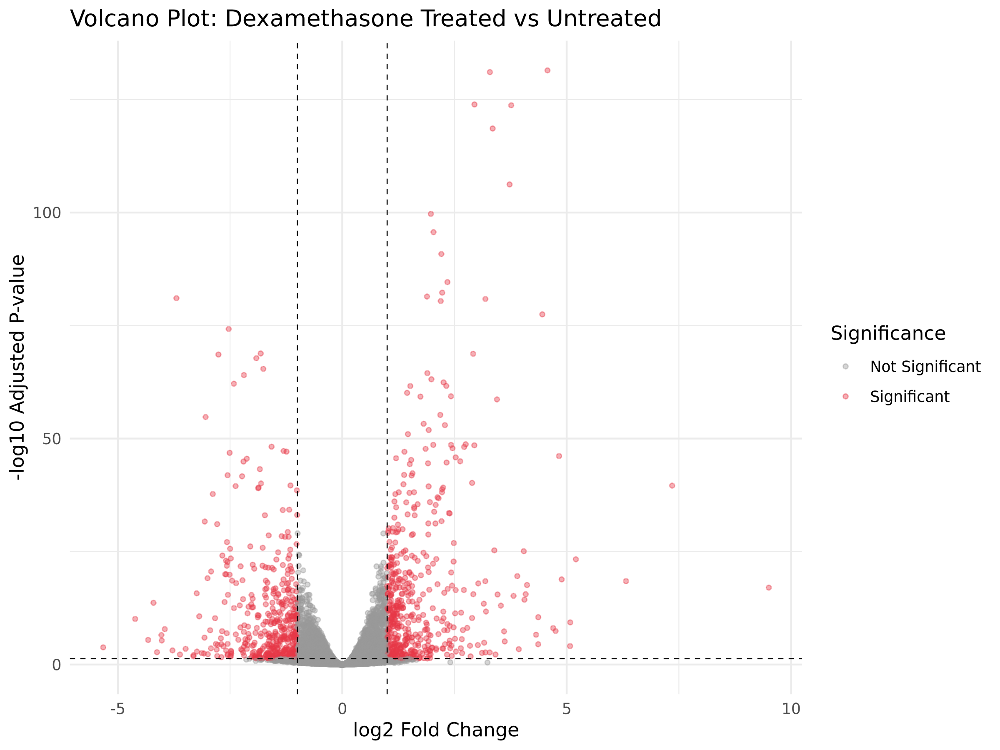
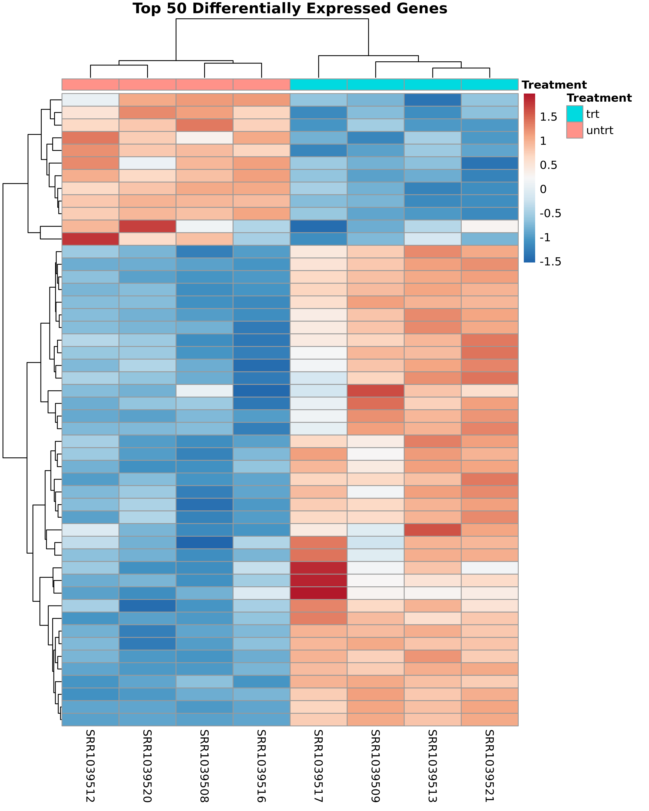
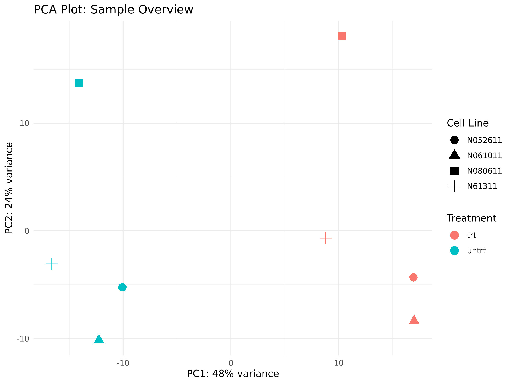

# RNA-seq Differential Expression Analysis
**Dexamethasone Treated vs Untreated Human Airway Cells**

## Background
Dexamethasone is a corticosteroid drug used to treat asthma and 
inflammation. This project analyzes which genes are significantly 
upregulated or downregulated in human airway smooth muscle cells 
when treated with dexamethasone, using publicly available RNA-seq data.

## Dataset
- **Source:** Bioconductor `airway` package
- **Experiment:** Human airway smooth muscle cells treated with dexamethasone
- **Samples:** 8 samples (4 treated, 4 untreated) across 4 cell lines
- **Original paper:** Himes et al. (2014) PLoS ONE

## Methods
| Step | Tool | Purpose |
|------|------|---------|
| Data loading | airway (R package) | Load RNA-seq count matrix |
| Filtering | Base R | Remove lowly expressed genes |
| Normalization + DE | DESeq2 | Differential expression analysis |
| Visualization | ggplot2, pheatmap | Volcano plot, heatmap, PCA |

## Results

### Key Findings
- **16,596 genes** passed expression filters (out of 63,677 total)
- **4,099 genes** were significantly differentially expressed (padj < 0.05)
- **2,618 genes upregulated**, **2,298 genes downregulated** by dexamethasone
- PCA showed clean separation of treated vs untreated samples on PC1 (48% variance)

### Volcano Plot
Shows all tested genes. Red dots = significant (padj < 0.05 and |log2FC| > 1)



### Heatmap
Top 50 most significantly DE genes. Samples automatically cluster by treatment.



### PCA Plot
PC1 (48% variance) separates treated vs untreated samples perfectly.



## How to Reproduce
```bash
# Clone the repo
git clone https://github.com/Nupur1606/rnaseq-de-analysis.git
cd rnaseq-de-analysis

# Install R dependencies
R -e 'install.packages("BiocManager")'
R -e 'BiocManager::install(c("DESeq2", "airway", "SummarizedExperiment"))'
R -e 'install.packages(c("ggplot2", "pheatmap", "RColorBrewer"))'

# Run analysis
Rscript scripts/analysis.R
```

## What I Would Do Next
- Add gene name annotation (convert Ensembl IDs to gene symbols)
- Run pathway enrichment analysis with fgsea
- Apply the same pipeline to a cancer dataset from NCBI GEO
- Automate the pipeline with Snakemake

## Tools Used
R 4.4.1 · DESeq2 · ggplot2 · pheatmap · Ubuntu/WSL · Git